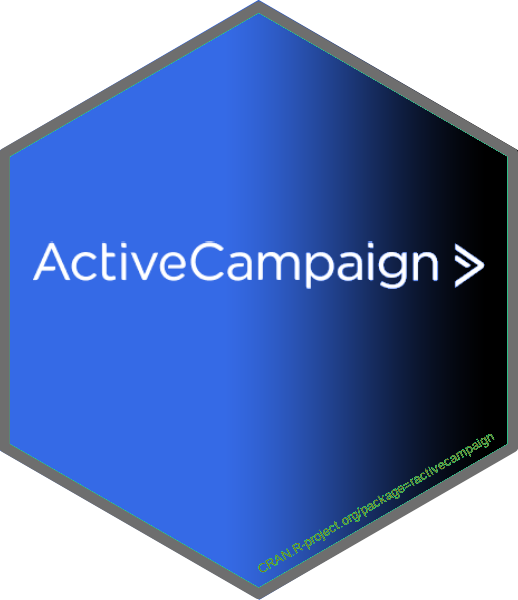

# ractivecampaign - R пакет для работы с CRM ActiveCampaign API<a href='https://selesnow.github.io/rgoogleads/'></a>

<!-- badges: start -->
<!-- badges: end -->

Цель `ractivecampaign` упростить процесс запроса данных из ActiveCampaign API в R. На данный момент в `ractivecampaign` присутвует 16 функций:

* `ac_auth()` - Авторизация
* `ac_get_accounts()` - Список доступных аккаунтов
* `ac_get_custom_account_fields_values()` - Значения пользовательских полей аккаунтов
* `ac_get_custom_account_fields()` - Список пользовательских полей аккаунта
* `ac_get_deals()` - Список сделок
* `ac_get_custom_deal_fields_values()` - Значения пользовательских полей сделок
* `ac_get_custom_deal_fields()` - Список пользовательских полей сделок
* `ac_get_deal_piplines()` - Список групп этапов сделок
* `ac_get_deal_stages()` - Список этапов сделок
* `ac_get_deal_activities()` - Список активностей по сделке
* `ac_get_users()` - Список пользователей
* `ac_get_tags()` - Получить список всех созданных тегов
* `ac_get_contacts()` - Список контактов
* `ac_get_custom_contact_fields_values()` - Значения пользовательских полей контактов
* `ac_get_custom_contact_fields()` - Список пользовательских полей этапов
* `ac_get_contact_tags` - Получить теги определённых контактов.
* `ac_get_campaigns()` - Список кампаний
* `ac_get_campaigns_aggregate_revenues()` - Дохход по кампаниям
* `ac_get_campaigns_messages()` - Список сообщений кампаний
* `ac_get_messages()` - Список всех сообщений


## Установка

На данный момент пакет доступн для установки из GitHub:

``` r
# install.packages("ractivecampaign")
install.packages("devtools")
devtools::install_github('selesnow/ractivecampaign')
```

## Авторизация в ActiveCampaign API

Для авторизации вам необходимо найти в аккаунте URL и Ключ API, для этого перейдите в основном меню перейдите в Settings > Developer, там вы найдёте нужные данные.


# Пример
```r
library(ractivecampaign)
library(ggplot2)
  
# auth
ac_auth(url = 'Ваш API URL', key = 'Ваш API Key')
# get deals
deals <- ac_get_deals()
  
# analyze
deals %>% 
  mutate(date = as.Date(cdate)) %>% 
  group_by(date) %>% 
  summarise(deals = n_distinct(id)) %>% 
  ggplot( aes(date, deals) ) +
  geom_line() + geom_point() +
  labs(title = 'Deals by date from ActiveCampaign')
```


### Автор пакета
Алексей Селезнёв, Head of analytics dept. at [Netpeak](https://netpeak.net)
<Br>Telegram Channel: @R4marketing
<Br>Youtube Channel: [R4marketing](https://www.youtube.com/R4marketing/?sub_confirmation=1)
<Br>email: selesnow@gmail.com
<Br>Telegram: @AlexeySeleznev
<Br>facebook: [facebook.com/selesnow](https://www.facebook.com/selesnow)
<Br>blog: [alexeyseleznev.wordpress.com](https://alexeyseleznev.wordpress.com/)
